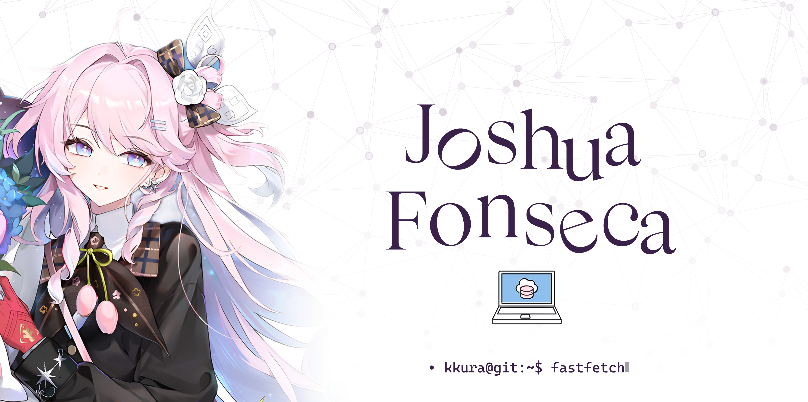
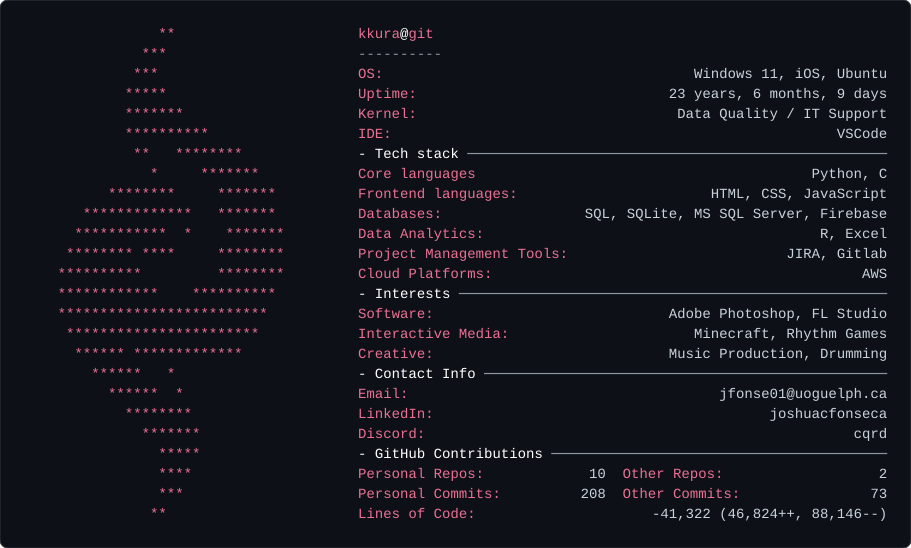

<!-- 1. Banner image at the top -->

<!-- 2. The fastfetch-style stats card, right underneath -->
<picture>
  <source media="(prefers-color-scheme: dark)" srcset="dark_mode.svg">
  <source media="(prefers-color-scheme: light)" srcset="light_mode.svg">
  
</picture>

<!-- 3. Everything else you add later goes below this line -->

# 💫 About Me:
I’m currently working on improving my programming skills through personal projects I’m currently learning more about software engineering, databases, and full-stack development Ask me about the projects I’m working on Fun fact: I enjoy rhythm games and making music (DAW: FL Studio 25) 

## 🌐 Socials:
   

<!-- Proudly created with GPRM ( https://gprm.itsvg.in ) -->
